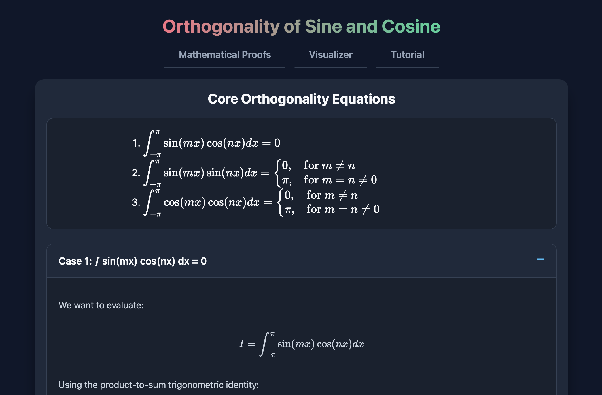

# Orthogonality of Sine and Cosine

An interactive educational web application designed to visually and mathematically demonstrate the orthogonality of sine and cosine functions.

## 🚀 Live Demo
Access the fully deployed application here: [https://jyx0615.github.io/Orthogonality/](https://jyx0615.github.io/Orthogonality/)

## ✨ Features
* **Mathematical Proofs:** 
  * Beautifully formatted, LaTeX-rendered integral equations explaining the core principles of orthogonality.
  * Collapsible, step-by-step mathematical derivations for the integration of `sin × cos`, `sin × sin`, and `cos × cos` over the period `[-π, π]`.
* **Interactive Visualizer:**
  * Select between Sine and Cosine functions and dynamically adjust their frequency using live sliders or inputs.
  * Generate the combined multiplication graph of the two independently selected waveforms.
  * Automatically visualize the integral by visually shading the area under the curve (green for positive area, red for negative area) and dynamically computing the exact total net area.
* **Educational Tutorial:**
  * Includes an embedded video tutorial section providing further conceptual context on waveform mathematics.

## 🛠️ Tech Stack
* **Frontend Structure & Styling:** HTML5, CSS3
* **Scripting & Canvas Manipulation:** Vanilla JavaScript (ES6)
* **Typography & Equation Rendering:** MathJax (LaTeX)
